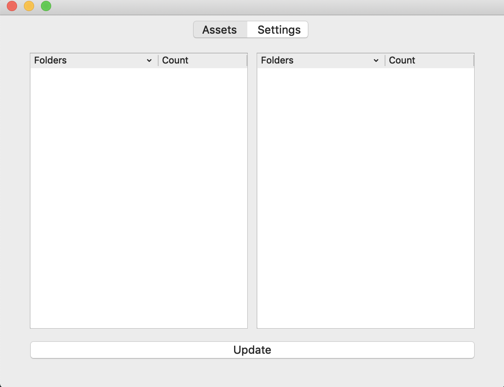
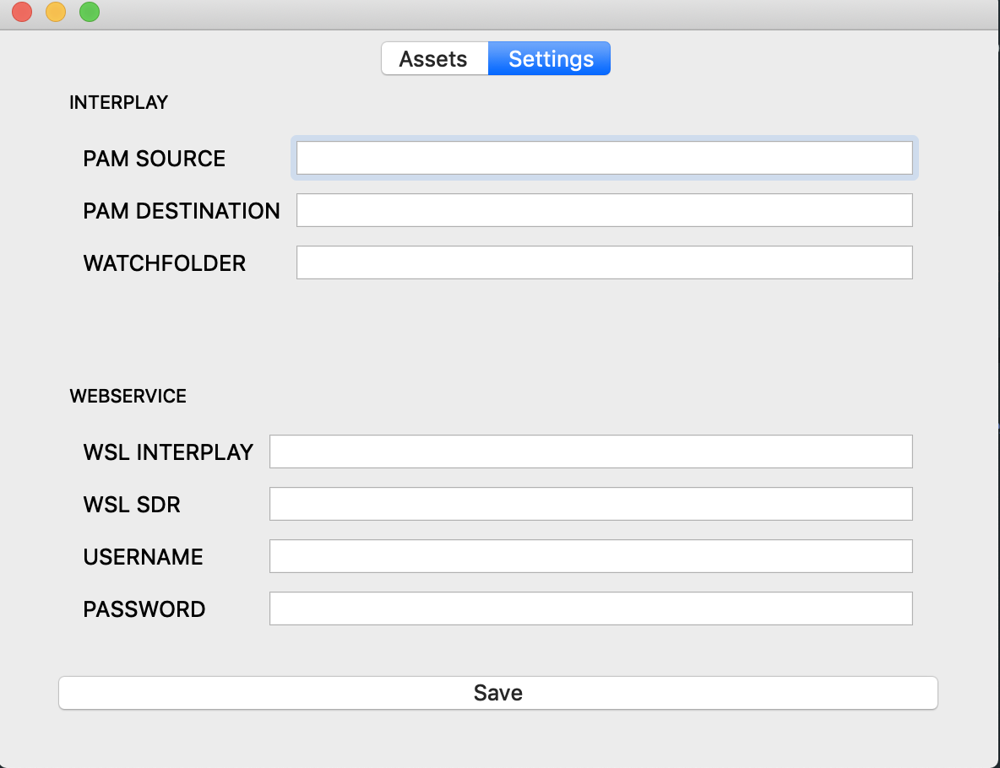

# SDR Monitor

---

| &nbsp;[](https://opensource.org/licenses/MIT)&nbsp;&nbsp; |

---

### About
> A GUI application to count the files of a folder or assets from AVID Interplay systems.

### Documentation

Monitor Interface:
<p align="center" >
    
</p>

Config Interface:
<p align="center" >
    
</p>

### Build Setup &nbsp; :construction:

``` 
pip install -r requirements.txt
```

### Getting started &nbsp;:running:

``` 
python application.py
```

### Build the exe file &nbsp; :construction:

```
pyinstaller -y -F -w -i "src/resource/monitoring64x64.ico" "application.py"
```


### Built With

* [PyQt5](https://www.riverbankcomputing.com/software/pyqt/intro) - set of Python v2 and v3 bindings for The Qt Company's Qt application framework.
* [Requests](https://2.python-requests.org//en/master/#) - Non-GMO HTTP library for Python, safe for human consumption.
* [Anytree](https://anytree.readthedocs.io/en/latest) - Simple, lightweight and extensible Tree data structure.
* [SQLAlchemy](https://www.sqlalchemy.org/) - Python SQL toolkit and Object Relational Mapper that gives application developers the full power and flexibility of SQL.
* [Zeep](https://python-zeep.readthedocs.io/en/master/) - A fast and modern Python SOAP client.

## Authors

* **Gustavo Silva** - *Initial work* - [SDR](https://github.com/gusilva/sdr)

## License

This project is licensed under the MIT License - see the LICENSE.md file for details